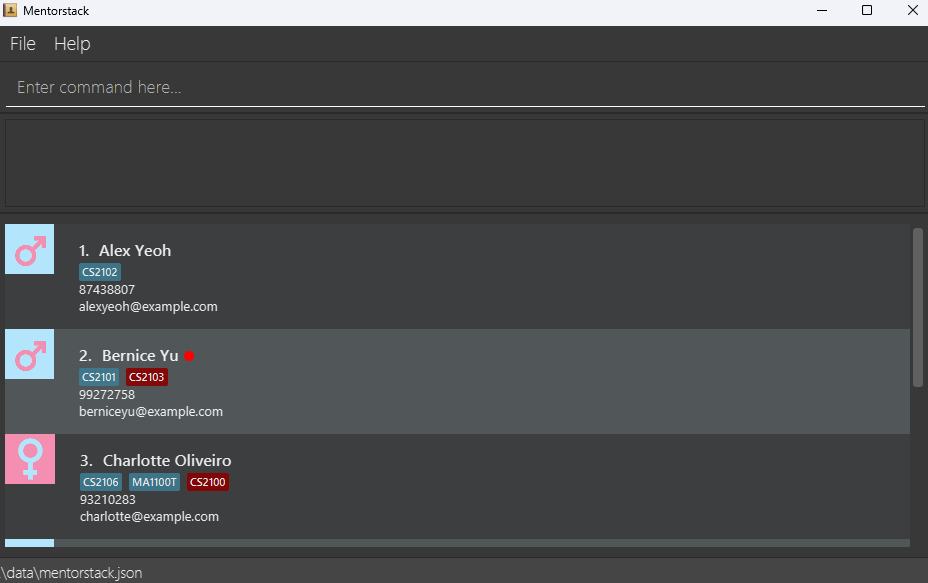
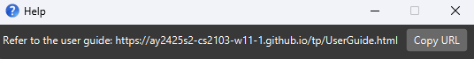
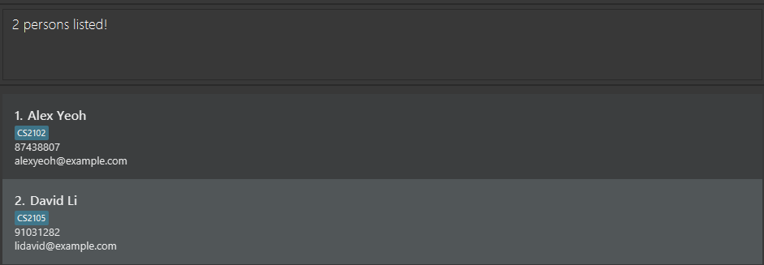

# Mentorstack User Guide

* Mentorstack helps CS tutors efficiently manage and track student contacts, attendance, participation, progress, and streamlines communication.
* It simplifies student management across different levels and courses while catering to tech-savvy users who may prefer a command-line interface (CLI).

<!-- * Table of Contents -->
<page-nav-print />

--------------------------------------------------------------------------------------------------------------------

## Quick start

1. Ensure you have Java `17` or above installed in your Computer. 
   **Mac users:** Ensure you have the precise JDK version prescribed [here](https://se-education.org/guides/tutorials/javaInstallationMac.html).

1. Download the latest `.jar` file from [here](https://github.com/AY2425S2-CS2103-W11-1/tp/releases).

1. Copy the file to the folder you want to use as the _home folder_ for Mentorstack.

1. Open a command terminal, `cd` into the folder you put the jar file in, and use the `java -jar mentorstack.jar` command to run the application. 
   A GUI similar to the below should appear in a few seconds. Note how the app contains some sample data. 
   

1. Type the command in the command box and press Enter to execute it. e.g. typing **`help`** and pressing Enter will open the help window. 
   Some example commands you can try:

   * `list` : Lists all contacts.

   * `add n/John Doe g/M p/98765432 e/johnd@example.com s/CS2103` : Adds a contact named `John Doe` to the Mentorstack.

   * `delete 3` : Deletes the 3rd contact shown in the current list.

   * `clear` : Deletes all contacts.

   * `exit` : Exits the app.

1. Refer to the [Features](#features) below for details of each command.

--------------------------------------------------------------------------------------------------------------------

## Features

<box type="info" seamless>

**Notes about the command format:** 

* Words in `UPPER_CASE` are the parameters to be supplied by the user. 
  e.g. in `add n/NAME`, `NAME` is a parameter which can be used as `add n/John Doe`.

* Items in square brackets are optional. 
  e.g `[n/NAME] [s/SUBJECT]` can be used as `n/John Doe s/CS2103` or as `n/John Doe` or as `s/CS2103`.

* Items with `…`​ after them can be used multiple times. 
  e.g. `[s/SUBJECT]…​` can be used as `s/CS2103`, `s/CS2103 s/LAJ1201` etc.

* Parameters can be in any order. 
  e.g. if the command specifies `n/NAME p/PHONE_NUMBER`, `p/PHONE_NUMBER n/NAME` is also acceptable.

* Extraneous parameters for commands that do not take in parameters (such as `help`, `list`, `exit` and `clear`) will be ignored. 
  e.g. if the command specifies `help 123`, it will be interpreted as `help`.

**Notes about entries in Mentorstack**:

* Each student entry in Mentorstack must have valid parameters for the following:
  - Name
  - Gender
  - Phone
  - Email
  - Subject

* Students must have 1 or more subjects, each subject can be marked as finished or unfinished.
* Students can be archived, in which case they will be moved to the archive list where they cannot be edited.
* Two student entries are considered the same entry if they have the same Name (case-sensitive).
* Mentorstack does not allow duplicate entries.
  - `Alex Yeoh` is a duplicate of `Alex Yeoh`, but is a different entry from `alex yeoh`.

If you are using a PDF version of this document, be careful when copying and pasting commands that span multiple lines as space characters surrounding line-breaks may be omitted when copied over to the application.
</box>

### Viewing help : `help`

Shows a message explaning how to access the help page.

Format: `help`

### Adding a person: `add`

Adds a student to the address book.

Format: `add n/NAME g/GENDER p/PHONE_NUMBER e/EMAIL s/SUBJECT…​`

<box type="tip" seamless>

**Tip:** A person can have any number of subjects (> 0).
</box>

A person can only have F or M as gender inputs.
</box>

Examples:
* `add n/John Doe g/M p/98765432 e/johnd@example.com s/CS2103`
* `add n/Betsy Crowe g/F s/CS2103 e/betsycrowe@example.com p/1234567 s/LAJ1201`

### Listing all persons : `list`

Shows a list of all persons in the address book.

Format: `list`

### Editing a person : `edit`

Edits an existing person in the address book.

Format: `edit INDEX [n/NAME] [g/GENDER] [p/PHONE] [e/EMAIL] [s/SUBJECT]…​`

* Edits the person at the specified `INDEX`. The index refers to the index number shown in the displayed person list. The index **must be a positive integer** 1, 2, 3, …​
* At least one of the optional fields must be provided.
* Existing values will be updated to the input values.
* When editing subjects, the existing subjects of the person will be removed i.e adding of subjects is not cumulative.
* Finished subjects cannot be edited.
* Cannot edit students who are already archived.

Examples:
*  `edit 1 p/91234567 e/johndoe@example.com` Edits the phone number and email address of the 1st person to be `91234567` and `johndoe@example.com` respectively.
*  `edit 2 n/Betsy Crower s/CS2103` Edits the name of the 2nd person to be `Betsy Crower` and changes their subjects to only `CS2103`.

### Locating persons by name: `find`

Finds persons whose names contain any of the given keywords.

Format: `find KEYWORD [MORE_KEYWORDS]`

* The search is case-insensitive. e.g `hans` will match `Hans`
* The order of the keywords does not matter. e.g. `Hans Bo` will match `Bo Hans`
* Only the name is searched.
* Partial words will be matched e.g. `Han` will match `Hans`
* Persons matching at least one keyword will be returned (i.e. `OR` search).
  e.g. `Hans Bo` will return `Hans Gruber`, `Bo Yang`

Examples:
* `find John` returns `john` and `John Doe`
* `find alex david` returns `Alex Yeoh`, `David Li` 

  

### Filtering persons by specific predicates: `view`

Filters persons based on values specified for different fields.

Format: `view [[f/FIELD] [v/VALUE]]…​`

* Field can take in 4 possible values:

Keyword | Field
--------|----------------------------------------------------------------------------------------------------------------------------------------------------------------------
**`n`** | NAME, filters entries containing VALUE
**`g`** | GENDER, filters entries containing VALUE
**`p`** | PHONE, filters entries containing VALUE
**`e`** | EMAIL, filters entries containing VALUE
**`s`** | SUBJECT, filters entries containing VALUE
**`a`** | ARCHIVED, filters entries by archived status (t for archived, f for non-archived)

* Values are case-insensitive.
* For NAME and SUBJECT, partial words will be matched e.g. `Han` will match `Hans`, `CS` will match `CS2103`
* For SUBJECT, only unfinished subjects will be considered e.g. finished subjects are not counted by the filter.
* For PHONE and EMAIL, partial words will be matched e.g. `123` will match `12345678`, `john` will match `john@doe.com`
* `view` with invalid, incomplete or no arguments will just list all persons.
* `view` can have multiple filters applied for any field (can be the same field).
* Persons matching all filters will be returned (i.e. `AND` search).

Examples:
* `view f/n v/john` returns `john` and `John Doe`.
* `view f/s v/CS` returns all entries taking CS courses.
* `view f/p v/12345678 f/e v/john@doe.com` returns only entries partially containing PHONE AND EMAIL. 

### Deleting a person : `delete`

Deletes the specified person from the Mentorstack.

Format: `delete INDEX…​`

* Deletes the person at the specified `INDEX`.
* The index refers to the index number shown in the displayed person list.
* The index **must be a positive integer** 1, 2, 3, …​
* Input can contain multiple indices.

Examples:
* `list` followed by `delete 2` deletes the 2nd person in Mentorstack.
* `find Betsy` followed by `delete 1` deletes the 1st person in the results of the `find` command.
* `list` followed by `delete 2 3` deletes the 2nd and 3rd person in Mentorstack.

### Clearing all entries : `clear`

Clears all entries from Mentorstack.

Format: `clear`

### Undo an operation : `undo`

* Undoes the previous operation in Mentorstack.
* Undo applies to all operations that modify the Mentorstack data storage e.g.  the `archive` command can be undone, but the `view` command cannot.
* Undo does not apply when there is no previous operation undoable.

Format: `undo`

### View statistics : `stats`

* Views statistics of Mentorstack, supports subject-based statistics.
* Shows gender distribution and total students.

Format: `stats [s/SUBJECT]`

Examples:
* `stats` shows the gender-based statistics of Mentorstack.
* `stats s/CS2102` shows the statistics of students currently enrolled in CS2103.

### Mark a student : `mark`

* Marks a student in Mentorstack.
* Marked students will have a red circle next to their name.
* Input can contain multiple indices.
* Students remain marked if they have already been marked.
* Archived students cannot be marked.

Format: `mark INDEX…​`

Examples:
* `list` followed by `mark 1 3` marks the 1st and 3rd student in the current list.

### Unmark a student : `unmark`

* Unmarks a student in Mentorstack.
* Input can contain multiple indices.
* Students remain unmarked if they have already been unmarked.
* * Archived students cannot be unmarked.

Format: `unmark INDEX…​`

Examples:
* `list` followed by `unmark 1 3` unmarks the 1st and 3rd student in the current list.

### Archive a student : `archive`

* Archives a student in Mentorstack.
* Archives students are moved to the archive list.
* Input can contain multiple indices.
* Will display students who are not archived after the command.

Format: `archive INDEX…​`

Examples:
* `list` followed by `archive 1 3` archives the 1st and 3rd student in the current list.

### Navigate to the archive list : `showarchive`

Lists the students in the archive list.

Format: `showarchive`

### Unarchive a student : `unarchive`

* Unarchives a student in Mentorstack.
* Unarchived students are moved back to the main list.
* Input can contain multiple indices.
* Operation can only be performed on students in the archive list.
* Will display students who are archived after the command.

Format: `unarchive INDEX…​`

Examples:
* `showarchive` followed by `unarchive 1 3` unarchives the 1st and 3rd student in the archived list.

### Indicate that a student has finished a subject : `finish`

* Indicates that a student has finished a subject.
* Finished subjects are still shown but will be marked as a different colour.

Format: `finish INDEX s/SUBJECT…​`

* Input can only contain subjects that students have enrolled in.
* Input can contain multiple subjects.
* Finished subjects remain finished.
* Subjects of archived students cannot be finished.

Examples:
* `finish 1 s\CS2103` marks CS2103 as completed by student 1.

### Indicate that a student has not finished a subject : `unfinish`

* Indicates that a student has not finished a subject.
* Primarily used as a reversal operation for `finish`

Format: `unfinish INDEX s/SUBJECT…​`

* Input can only contain subjects that students have enrolled in.
* Input can contain multiple subjects.
* Unfinished subjects remain unfinished.
* Subjects of archived students cannot be unfinished.

Examples:
* `unfinish 1 s\CS2103` marks CS2103 as not completed by student 1.

### Exiting the program : `exit`

Exits the program.

Format: `exit`

### Changing Mentorstack theme

Mentorstack provides 3 visual themes to suit your preferences. You can change the theme by navigating to the View menu.

Number| Theme
------|----------------------------------------------------------------------------------------------------------------------------------------------------------------------
1     | Dark
2     | Pink
3     | Light

Mentorstack will always launch the Dark theme by default.

### Viewing bar chart statistics

Mentorstack provides users with the option to view the statistics of students in the current active list, sorted by currently enrolled subjects.
Users may view these statistics by navigating to the View menu.

### Saving the data

Mentorstack data are saved in the hard disk automatically after any command that changes the data. There is no need to save manually.

### Editing the data file

Mentorstack data are saved automatically as a JSON file `[JAR file location]/data/mentorstack.json`. Advanced users are welcome to update data directly by editing that data file.

<box type="warning" seamless>

**Caution:**
If your changes to the data file makes its format invalid, Mentorstack will discard all data and start with an empty data file at the next run.  Hence, it is recommended to take a backup of the file before editing it. 
Furthermore, certain edits can cause Mentorstack to behave in unexpected ways (e.g., if a value entered is outside the acceptable range). Therefore, edit the data file only if you are confident that you can update it correctly.
</box>

--------------------------------------------------------------------------------------------------------------------

## FAQ

**Q**: How do I transfer my data to another Computer? 
**A**: Install the app in the other computer and overwrite the empty data file it creates with the file that contains the data of your previous Mentorstack home folder.

--------------------------------------------------------------------------------------------------------------------

## Known issues

1. **When using multiple screens**, if you move the application to a secondary screen, and later switch to using only the primary screen, the GUI will open off-screen. The remedy is to delete the `preferences.json` file created by the application before running the application again.
2. **If you minimize the Help Window** and then run the `help` command (or use the `Help` menu, or the keyboard shortcut `F1`) again, the original Help Window will remain minimized, and no new Help Window will appear. The remedy is to manually restore the minimized Help Window.

--------------------------------------------------------------------------------------------------------------------

## Command summary

Action          | Format, Examples
----------------|----------------------------------------------------------------------------------------------------------------------------------------------------------------------
**Add**         | `add n/NAME g/GENDER p/PHONE_NUMBER e/EMAIL s/SUBJECT…​`   e.g., `add n/James Ho g/M p/22224444 e/jamesho@example.com s/CS2103 s/LAJ1201`
**Clear**       | `clear`
**Delete**      | `delete INDEX..`  e.g., `delete 1 3` 
**Edit**        | `edit INDEX [n/NAME] [p/PHONE_NUMBER] [e/EMAIL] [s/SUBJECT]…​`  e.g.,`edit 2 n/James Lee e/jameslee@example.com`
**Find**        | `find KEYWORD [MORE_KEYWORDS]`  e.g., `find James Jake`
**List**        | `list`
**View**        | `view [[f/FIELD] [v/VALUE]]…​`  e.g.,`view f/n v/john f/s v/CS`
**Undo**        | `undo`
**Stats**       | `stats [s/SUBJECT]`  e.g., `stats s/CS2103`
**Mark**        | `mark INDEX…​`  e.g., `mark 2`
**Unmark**      | `unmark INDEX…​`  e.g., `unmark 2`
**Archive**     | `archive INDEX…​`  e.g., `archive 2`
**Showarchive** | `showarchive`
**Unarchive**   | `unarchive INDEX…​`  e.g., `unarchive 2`
**Finish**      | `finish INDEX s/SUBJECT…​`  e.g., `finish 2 s/CS2103`
**Unfinish**    | `unfinish INDEX s/SUBJECT…​`  e.g., `unfinish 2 s/CS2103`
**Exit**        | `exit`
**Help**        | `help`
